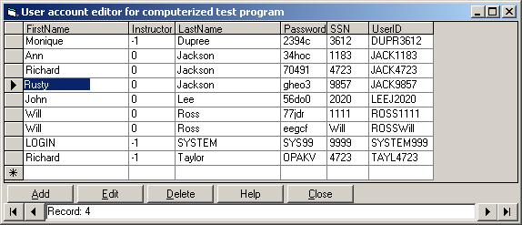



## User account  editor for the "computerized test taker"

### Description

This code goes hand in hand with the computerized test taker. It allows people without microsoft access an easier way to edit user passwords, login names, and other things like the persons name and the SSN. I actualy use this more than microsoft access to edit the database because it makes it so easy to add, delete, and change the user accounts. SOON TO COME:a program like this but shows you all the test info such the person's userID, score, testname, and time and date of test taken. Keep your eyes open.
 
### More Info
 
To use this code, your database (login.mdb) and other computerized test taking files must be located in: C:\program Files\Computerized Test Taker\

             |
---                |---
**Submitted On**   |2002-09-24 19:44:38
**By**             |[Will Ross](https://github.com/Planet-Source-Code/PSCIndex/blob/master/ByAuthor/will-ross.md)
**Level**          |Intermediate
**User Rating**    |4.8 (19 globes from 4 users)
**Compatibility**  |VB 5\.0, VB 6\.0
**Category**       |[Complete Applications](https://github.com/Planet-Source-Code/PSCIndex/blob/master/ByCategory/complete-applications__1-27.md)
**World**          |[Visual Basic](https://github.com/Planet-Source-Code/PSCIndex/blob/master/ByWorld/visual-basic.md)
**Archive File**   |[User\_accou1363409252002\.zip](https://github.com/Planet-Source-Code/will-ross-user-account-editor-for-the-computerized-test-taker__1-39275/archive/master.zip)

